# 💳 Credit Card Fraud Detection

**End-to-end fraud detection pipeline on 1.3M credit card transactions.** It covers exploratory analysis, 30 engineered behavioural features, SMOTE class balancing, LightGBM, cost-based threshold tuning, SHAP explanations, anomaly detection, customer segmentation and an interactive Streamlit dashboard.

| | |
|---|---|
| **Data** | 1,296,675 transactions · 983 cards · 693 merchants · Jan 2019 – Jun 2020 · 0.58% fraud |
| **Features** | 30 engineered features (velocity, behavioural baseline, time, geography) |
| **Imbalance** | SMOTE vs. class weights vs. no handling, compared head to head |
| **Best model** | LightGBM + SMOTE |
| **Test PR-AUC** | **0.984** (ROC-AUC 0.9997) on future, unseen transactions |
| **Business result** | Catches **98.0% of frauds / 99.5% of fraud dollars**; 77% of alerts are real fraud (~18 alerts/day) |

---

## Table of contents
1. [Quick start](#-quick-start)
2. [Workflow](#-workflow)
3. [Project structure — what every file does](#-project-structure--what-every-file-does)
4. [The 30 engineered features](#-the-30-engineered-features)
5. [Methodology — key decisions](#-methodology--key-decisions)
6. [Results](#-results)
7. [Customer segmentation](#-customer-segmentation)
8. [Dashboard](#-dashboard)
9. [Scoring new transactions](#-scoring-new-transactions)
10. [Tests](#-tests)
11. [Limitations & next steps](#-limitations--next-steps)

---

## 🚀 Quick start

```powershell
# 1. Clone and enter the project
git clone https://github.com/Somesh-Kennedy/credit-card-fraud-detection.git
cd credit-card-fraud-detection

# 2. Create + activate a virtual environment (Windows PowerShell; on macOS/Linux: source .venv/bin/activate)
python -m venv .venv
.\.venv\Scripts\Activate.ps1

# 3. Install dependencies and the project package itself (editable mode)
pip install -r requirements.txt
pip install -e .

# 4. Get the data: download credit_card_transactions.csv from Kaggle
#    ("Credit Card Transactions Dataset") and place it at:
#    dataset/credit_card_transactions.csv

# 5. Run the full pipeline (~5-6 minutes on a laptop)
python -m fraud.train

# 6. Explore the results
streamlit run app/streamlit_app.py                                # interactive dashboard
python -m fraud.predict --input examples/sample_transactions.csv # score new transactions
pytest                                                           # run the test suite
```

> **Short on time?** `python -m fraud.train --quick` runs everything on a random 25% of cards in about 2 minutes.

---

## 🔄 Workflow

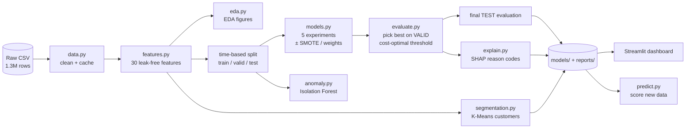

**Step by step**: everything below runs from the single command `python -m fraud.train`.

| # | Stage | Module | What happens | Output |
|---|---|---|---|---|
| 1 | **Load & clean** | `data.py` | Reads the CSV with explicit dtypes. Drops PII (names, street, transaction id) and broken columns (`unix_time` is shifted 7 years). Parses dates and sorts by card + time. | `data/transactions_clean.parquet` |
| 2 | **Feature engineering** | `features.py` | Builds 30 features. Every per-card feature uses only that card's **past** transactions, exactly what a real-time system would know at swipe time. | `data/transactions_features.parquet` |
| 3 | **EDA** | `eda.py` | Class balance, amounts, fraud by hour / category / month, feature signal and a geographic map. | `reports/figures/eda_*.png` |
| 4 | **Time split** | `data.py` | Train = 2019 · Validation = Q1 2020 · Test = Apr–Jun 2020. | — |
| 5 | **Train 5 experiments** | `models.py` | Logistic regression and LightGBM, each with no imbalance handling, SMOTE, or class weights. SMOTE runs inside an `imblearn` Pipeline so it only touches training data. | — |
| 6 | **Model selection** | `train.py` | Best model = highest **validation** PR-AUC. | — |
| 7 | **Threshold tuning** | `evaluate.py` | Chooses the probability cut-off that minimises *missed fraud $ + $10 × false alarms* on validation. | `threshold_cost.png` |
| 8 | **Final test** | `evaluate.py` | The test set is used exactly once, with the chosen model and threshold. | `metrics.json`, PR/ROC/confusion plots |
| 9 | **Anomaly baseline** | `anomaly.py` | Isolation Forest trained without labels, for comparison. | row in `model_comparison_test.csv` |
| 10 | **Explainability** | `explain.py` | Exact TreeSHAP values: global importance plus per-transaction reason codes. | `feature_importance.png/.csv` |
| 11 | **Segmentation** | `segmentation.py` | K-Means on card-level spending profiles. | `segments.png`, `segments_summary.csv` |
| 12 | **Save** | `train.py` | Model bundle (pipeline + threshold + metadata) and a scored test set for the dashboard. | `models/fraud_model.joblib` |

---

## 📁 Project structure — what every file does

```
credit-card-fraud-detection/
├── src/fraud/                  ← the Python package (all pipeline logic)
│   ├── __init__.py
│   ├── config.py
│   ├── data.py
│   ├── features.py
│   ├── preprocessing.py
│   ├── models.py
│   ├── evaluate.py
│   ├── explain.py
│   ├── anomaly.py
│   ├── segmentation.py
│   ├── eda.py
│   ├── train.py
│   └── predict.py
├── app/
│   └── streamlit_app.py        ← interactive dashboard
├── notebooks/
│   └── 01_eda.ipynb            ← narrated exploratory analysis
├── tests/
│   ├── conftest.py
│   ├── test_features.py
│   └── test_pipeline.py
├── examples/
│   └── sample_transactions.csv ← 12 transactions to try predict.py on
├── reports/                    ← committed results (metrics, tables, figures)
├── dataset/                    ← put the Kaggle CSV here (git-ignored)
├── data/                       ← Parquet caches + scored data (git-ignored, generated)
├── models/                     ← trained model bundle (git-ignored, generated)
├── pyproject.toml
├── requirements.txt
└── .gitignore
```

### Package: `src/fraud/`

| File | Purpose | Key contents |
|---|---|---|
| **`config.py`** | Single source of truth. Every path, split date, column name, feature list and hyper-parameter lives here, so nothing is hard-coded twice. | `FEATURES` (the 30 features), `VALID_START` / `TEST_START`, `SMOTE_RATIO`, `FALSE_POSITIVE_COST`, `ensure_dirs()` |
| **`data.py`** | Loading, cleaning and splitting. Turns the raw CSV into a typed, PII-free, chronologically sorted table and caches it as Parquet (about 10× faster to reload). | `load_raw()`, `clean()`, `load_clean()`, `time_split()`, `describe_split()` |
| **`features.py`** | **The heart of the project.** Engineers the 30 features. Velocity windows use a vectorised `searchsorted` + cumulative-sum trick, so 1.3M rows take about 4 seconds. All history features exclude the current and future rows. | `build_features()`, `haversine_km()`, `_window_count_and_sum()`, `_expanding_prior_mean()` |
| **`preprocessing.py`** | A scikit-learn `ColumnTransformer`. Numeric features are median-imputed and standardised; categorical features are one-hot encoded. All statistics are learned on training data only. | `build_preprocessor()` |
| **`models.py`** | Defines the 5 experiments as `imblearn` Pipelines (`preprocess → [SMOTE] → classifier`). Because imblearn's Pipeline skips samplers at prediction time, SMOTE can never leak into evaluation. | `MODEL_SPECS`, `build_pipeline()` |
| **`evaluate.py`** | Imbalance-appropriate metrics (PR-AUC, precision@recall, dollar impact), vectorised cost-optimal threshold search and all evaluation plots. | `compute_metrics()`, `best_cost_threshold()`, `cost_curve()`, `plot_*()` |
| **`explain.py`** | Explains predictions using LightGBM's built-in exact TreeSHAP (`pred_contrib=True`), so no extra `shap` dependency. One-hot columns are summed back into their parent feature. | `contributions()`, `reason_codes()`, `global_importance()` |
| **`anomaly.py`** | Unsupervised Isolation Forest trained only on legitimate transactions. It shows how much labels are worth and acts as a safety net for unseen fraud patterns. | `fit_isolation_forest()`, `anomaly_scores()` |
| **`segmentation.py`** | Aggregates each card into a spending profile (frequency, ticket size, online/night/weekend share, age, city size), runs K-Means and auto-names each segment from its two most distinctive traits. | `card_profiles()`, `segment_customers()`, `plot_segments()` |
| **`eda.py`** | Reusable EDA chart functions shared by the notebook and the pipeline, so README figures and notebook figures always match. | `class_balance()`, `fraud_rate_by()`, `monthly_trend()`, `feature_signal()`, `fraud_map()`, `save_all()` |
| **`train.py`** | The orchestrator and CLI. Runs stages 1–12 in order, logs progress and writes every artefact. | `run()`, `main()`. Flags: `--quick`, `--models`, `--rebuild`, `--skip-eda`, `--skip-segments`, `--skip-anomaly` |
| **`predict.py`** | Inference. Behavioural features need history, so it merges new transactions with each card's past, rebuilds features, then returns probability, decision and the top reasons. | `load_bundle()`, `score()`, CLI `main()` |

### Everything else

| File | Purpose |
|---|---|
| **`app/streamlit_app.py`** | Six-tab dashboard: Overview, Model performance (live threshold slider with $ impact), Transaction explorer (SHAP waterfall per transaction), Live scoring (invent a transaction for a real card), Geography (state choropleth and caught/missed fraud map), Customer segments. |
| **`notebooks/01_eda.ipynb`** | Narrated EDA. It answers *how imbalanced, when, where, who* and whether the engineered features separate fraud, then maps each finding to a modelling decision. Outputs are saved, so it renders on GitHub. |
| **`tests/conftest.py`** | Builds a small synthetic dataset, so tests run in seconds without the 340 MB CSV. |
| **`tests/test_features.py`** | Proves the features are correct and **leak-free**: recomputing features on truncated history gives identical values, flipping labels changes nothing, and velocity windows match hand-computed values. |
| **`tests/test_pipeline.py`** | Covers the chronological split, all 5 models training end to end, SMOTE being skipped at predict time, metric correctness and cost-threshold logic. |
| **`examples/sample_transactions.csv`** | 12 real transactions from the final week (4 fraud, PII removed) for trying `predict.py`. |
| **`reports/`** | `metrics.json` (full results of the best model), `model_comparison_{valid,test}.csv`, `feature_importance.csv`, `segments_summary.csv` and `figures/`. |
| **`pyproject.toml`** | Makes `src/fraud` an installable package (`pip install -e .`) and registers the `fraud-train` / `fraud-predict` commands. |
| **`requirements.txt`** | Dependencies, each with a comment explaining why it is needed. |

---

## 🧬 The 30 engineered features

Raw columns describe a transaction **in isolation**. Fraud is visible in **context**: is this normal *for this card*? These features add that context.

| # | Group | Feature | Intuition |
|---|---|---|---|
| 1 | Transaction | `amt` | Purchase amount |
| 2 | Transaction | `log_amt` | log(1 + amount); tames the long tail for linear models |
| 3 | Customer | `age` | Card-holder age at purchase time |
| 4 | Customer | `log_city_pop` | Urban vs. rural home city |
| 5–7 | Time | `hour`, `hour_sin`, `hour_cos` | Time of day; sin/cos make 23:00 and 00:00 "close" |
| 8–9 | Time | `day_of_week`, `is_weekend` | Weekly pattern |
| 10 | Time | `is_night` | 22:00–03:59, when the fraud rate is more than 10× higher |
| 11 | Geography | `cust_merch_dist_km` | Haversine distance from home to merchant |
| 12 | Geography | `km_from_prev_txn` | Distance from the previous merchant |
| 13 | Geography | `speed_kmh_from_prev` | Implied travel speed ("impossible travel") |
| 14 | Velocity | `secs_since_prev_txn` | Time since the card was last used |
| 15–17 | Velocity | `txn_count_1h / 24h / 7d` | Number of purchases in trailing windows |
| 18–20 | Velocity | `amt_sum_1h / 24h / 7d` | Dollars spent in trailing windows |
| 21 | Behavioural | `card_txn_count_hist` | How much history the card has |
| 22–23 | Behavioural | `card_amt_mean_hist`, `card_amt_std_hist` | The card's normal spend and its spread |
| 24 | Behavioural | `amt_zscore_card` | Standard deviations above the card's normal |
| 25 | Behavioural | `amt_to_card_mean_ratio` | Amount ÷ card's average |
| 26 | Behavioural | `amt_to_card_cat_mean_ratio` | Amount ÷ card's average **in this category** |
| 27–28 | Behavioural | `is_new_merchant`, `is_new_category` | First time this card has used this merchant / category |
| 29 | Categorical | `category` | 14 merchant categories (one-hot) |
| 30 | Categorical | `gender` | F / M (one-hot) |

**EDA confirms the design.** Fraud medians compared with legitimate medians:

- Amount: $397 vs $47
- Spend in the last 24h: $2,242 vs $234
- Amount relative to the card's average: 5.2× vs 0.66×
- Fraud happens at night far more often

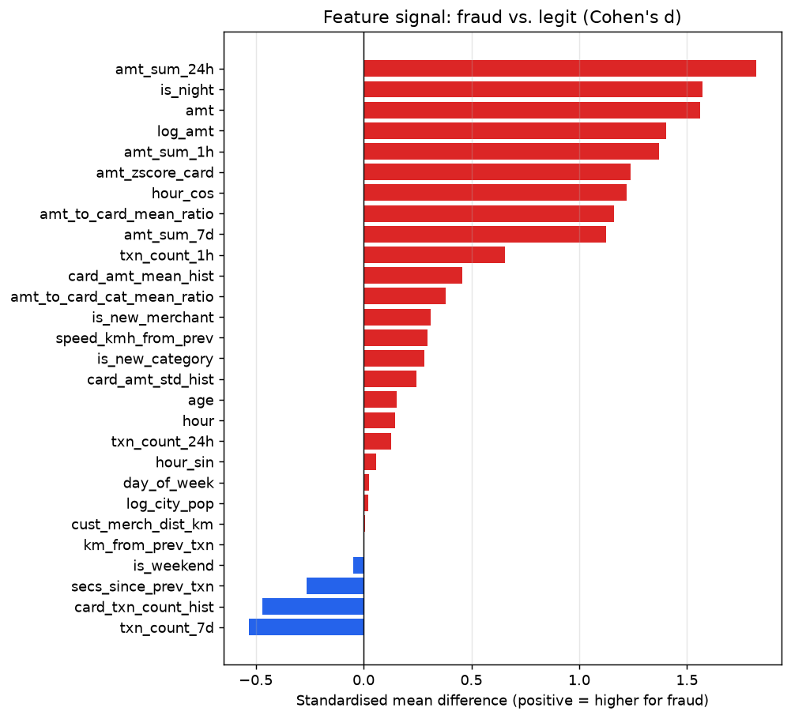

---

## 🧠 Methodology — key decisions

**1. Time-based split, not random.** Fraud models score *future* transactions, and fraud patterns drift month to month (see below). A random split would let the model learn from the same fraud episodes it is tested on and inflate every metric. Instead: train on 2019, tune on Q1 2020, test once on Apr–Jun 2020.

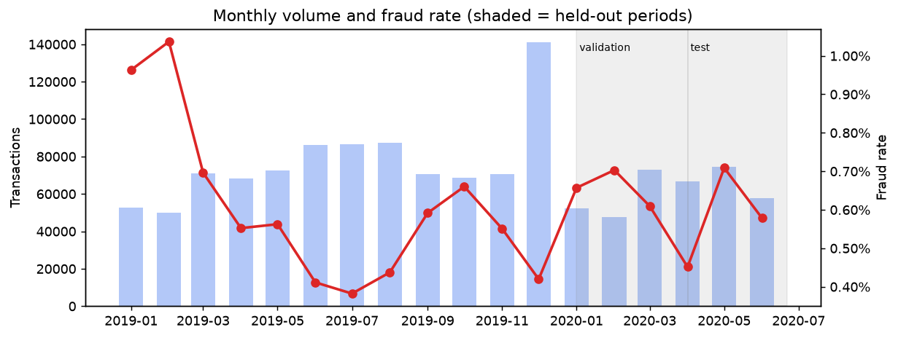

**2. No leakage in features.** Every per-card feature uses only earlier transactions and never the label. `tests/test_features.py` verifies this mathematically.

**3. SMOTE inside the pipeline.** SMOTE creates synthetic frauds by interpolating between real frauds and their nearest fraud neighbours. It runs **after** preprocessing (it needs scaled numeric data) and **only during `fit`**. `imblearn.Pipeline` guarantees this. Frauds are oversampled to 10% of the legitimate count, not 50/50, which would add about 900K synthetic rows and over-predict fraud.

**4. The right metrics.** With 0.58% fraud, a model that always says "legit" is 99.4% accurate. The headline metric is **PR-AUC**. We also report precision at 80/90/95% recall and dollar impact. ROC-AUC is shown but treated as secondary, because it flatters weak models on imbalanced data.

**5. A business-driven threshold.** The default 0.5 cut-off is arbitrary. The threshold minimises **missed-fraud dollars + $10 per false alarm** on the validation set. Because a missed $900 fraud costs far more than a review, the optimum is a low threshold (0.009). The F1-optimal threshold would be 0.33.

---

## 📊 Results

### Model comparison: test set (Apr–Jun 2020, 198,982 transactions, 1,163 frauds)

Each model uses its own cost-optimal threshold chosen on validation. The best model was selected on **validation** PR-AUC.

| Model | PR-AUC | ROC-AUC | Precision | Recall | F1 | Precision @ 90% recall | Fraud $ caught |
|---|---|---|---|---|---|---|---|
| **LightGBM + SMOTE** ⭐ | **0.984** | **0.9997** | 0.767 | **0.980** | 0.860 | **0.989** | **99.5%** |
| LightGBM | 0.984 | 0.9996 | 0.781 | 0.979 | 0.869 | 0.988 | 99.4% |
| LightGBM + class weights | 0.981 | 0.9995 | 0.824 | 0.972 | 0.892 | 0.985 | 99.3% |
| Logistic regression | 0.646 | 0.9642 | 0.286 | 0.775 | 0.417 | 0.057 | 90.3% |
| Logistic regression + SMOTE | 0.536 | 0.9834 | 0.384 | 0.841 | 0.527 | 0.166 | 93.4% |
| Isolation Forest (unsupervised) | 0.322 | 0.9536 | 0.413 | 0.528 | 0.463 | 0.044 | 81.4% |

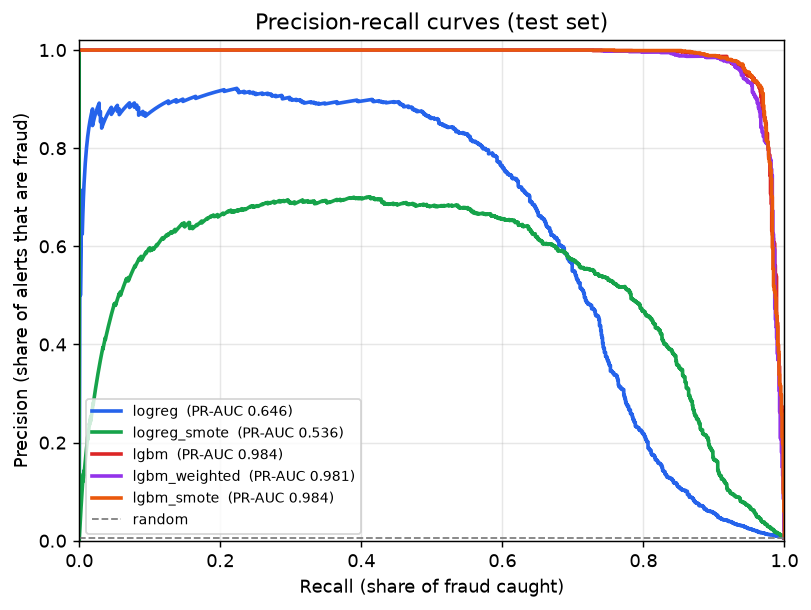

### Best model in business terms

Test period: 82 days.

| | |
|---|---|
| Frauds caught | **1,140 of 1,163** (98.0%) |
| False alarms | 347 out of 197,819 legitimate transactions (0.18%) |
| Fraud dollars caught | **$616,250 of $619,630** (99.5%) |
| Analyst review cost | $3,470 (347 × $10) |
| **Net savings vs. no model** | **$612,780** |
| Alert volume | ~18 per day, 77% of which are real fraud |

<p float="left">
  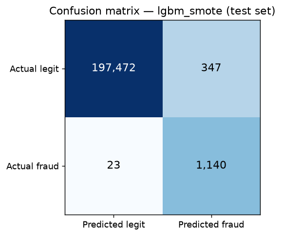
  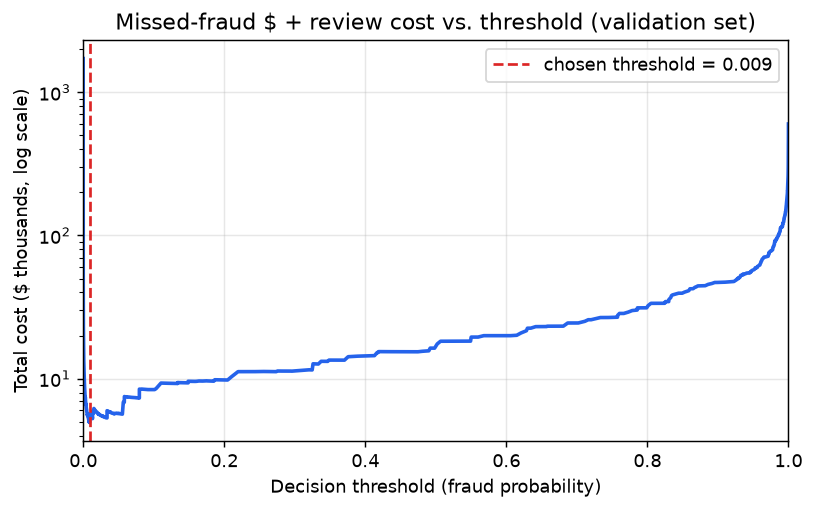
</p>

### Honest findings

- **Feature engineering mattered far more than the imbalance strategy.** All three LightGBM variants land within 0.003 PR-AUC of each other. SMOTE won on validation (0.9902 vs. 0.9892) and is essentially tied on test. The jump from logistic regression (0.65) to LightGBM (0.98) comes from non-linear interactions between the behavioural features. One example: a high amount *and* night *and* a 24h spending burst.
- **SMOTE hurt logistic regression's PR-AUC** (0.70 → 0.58 on validation), even though it raised ROC-AUC and recall. SMOTE pushes a linear decision boundary towards the minority class, buying recall at the cost of precision in the high-confidence region. This is a known trade-off, and a good example of why PR-AUC and ROC-AUC can disagree.
- **Class weights give the best precision** (82%) at slightly lower recall. If analyst capacity is the bottleneck, it is a sensible alternative.
- **Unsupervised detection is no substitute for labels.** Isolation Forest ranks fraud reasonably (ROC-AUC 0.95) but at the same alert volume it catches only 53% of frauds. It is still useful as a safety net for new fraud patterns the supervised model has never seen.

### What drives the predictions (SHAP)

The largest contributions come from:

- **24h spending velocity**
- **amount**
- **merchant category**
- **night-time**
- **time since the card's previous transaction**

Every prediction comes with reason codes. For example: `amt_sum_24h = 3,669 (+5.40) | category = grocery_pos (+4.86) | amt = 297.5 (+3.91)`.

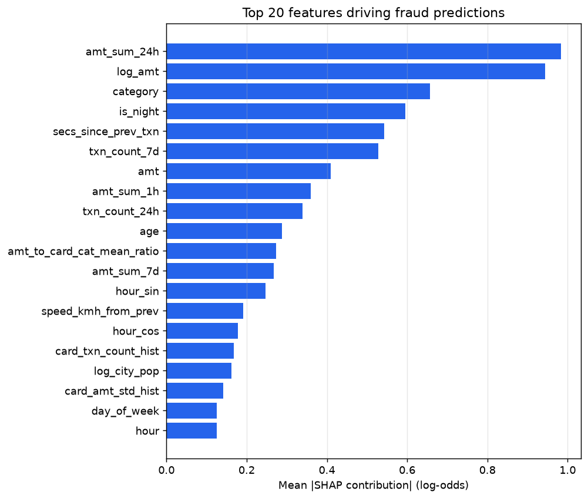

### EDA highlights

| | |
|---|---|
| 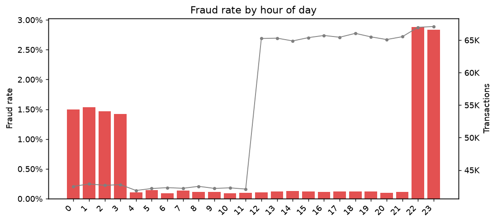 | 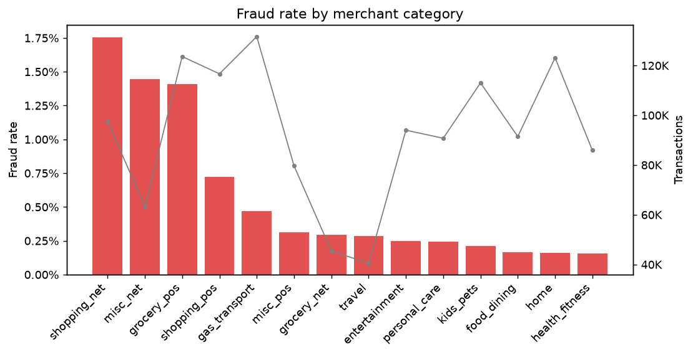 |
| 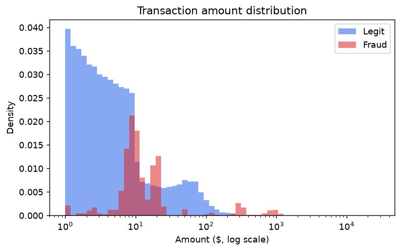 | 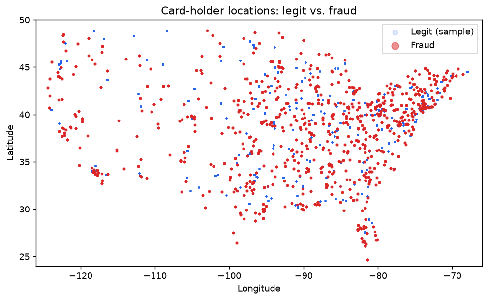 |

- Fraud is **more than 10× more likely between 22:00 and 03:59** (~1.4–2.9% vs ~0.1% in the daytime).
- Fraud amounts are **bimodal**: small "card-testing" charges ($5–50) and large cash-outs ($200–1,300).
- **Online shopping, misc online and grocery POS** have 3–10× the average fraud rate.
- Fraud is spread across the US, so location alone is a weak signal.

The full narrative is in [`notebooks/01_eda.ipynb`](notebooks/01_eda.ipynb).

---

## 👥 Customer segmentation

K-Means (K = 5) on card-level spending profiles. Segments are auto-named from their two most distinctive traits.

| Segment | Cards | Avg ticket | Monthly spend | Avg age | Fraud rate |
|---|---|---|---|---|---|
| High-ticket / Big spender | 194 | $90.5 | $8,375 | 37 | 0.59% |
| In-store / Night owl | 187 | $65.4 | $3,661 | 66 | **0.84%** |
| Weekend shopper / Younger | 59 | $58.6 | $5,960 | 21 | 0.70% |
| Daytime / Low-ticket | 214 | $57.2 | $5,714 | 37 | 0.59% |
| Rural / Older | 254 | $62.5 | $4,205 | 61 | **0.84%** |

**Insight:** the two older segments see about **40% more fraud** than the rest (0.84% vs 0.59%). This supports extra protection, such as step-up verification or alerts, for older card-holders.

**Caveat:** silhouette scores are low for every K (0.22–0.30), so customers in this synthetic dataset do not form sharply separated groups. K = 5 was chosen for interpretability; treat the segments as descriptive personas, not hard boundaries.

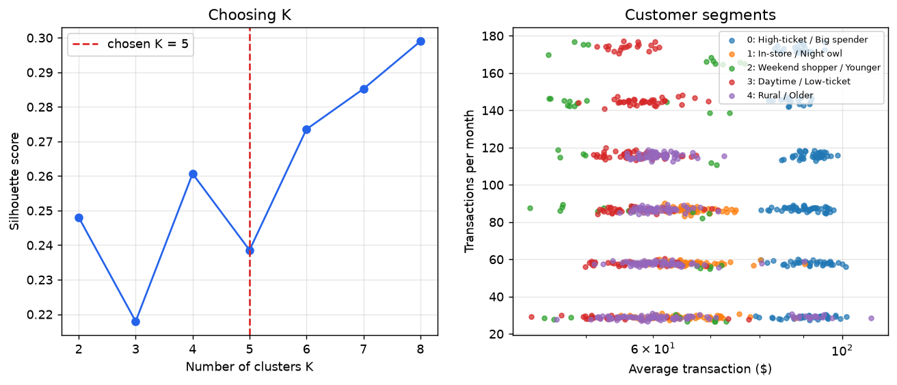

---

## 🖥️ Dashboard

```powershell
streamlit run app/streamlit_app.py
```

| Tab | What you can do |
|---|---|
| **Overview** | KPIs, monthly volume vs. fraud rate, fraud by category and hour |
| **Model performance** | Compare all models; **drag the threshold slider** and change the review cost, and precision, recall, alerts per day and net savings update live |
| **Transaction explorer** | Browse caught frauds, false alarms and missed frauds; see a **SHAP waterfall** explaining each score |
| **Live scoring** | Pick a real card, invent a purchase (amount, category, time, distance) and get a real-time decision with reasons |
| **Geography** | Fraud-rate choropleth by state; map of test-set frauds coloured caught / missed |
| **Customer segments** | Segment profiles and how often each segment is targeted |

---

## 🔮 Scoring new transactions

```powershell
python -m fraud.predict --input examples/sample_transactions.csv --output scored.csv --top-k 3
```

The input uses the same columns as the Kaggle CSV (`is_fraud` is optional). Each card's history is pulled from the cleaned dataset, so velocity and behavioural features are computed exactly as in training. Result on the bundled sample: **4 of 4 frauds flagged, 0 of 8 legitimate transactions flagged.**

```
category      amt     is_fraud  fraud_probability  decision        top_reasons
grocery_pos   297.52  1         0.9999             FRAUD - review  amt_sum_24h = 3,669.1 (+5.40) | category = grocery_pos (+4.86) | ...
misc_pos       37.27  0         0.0000             OK              is_night = 1 (+1.03) | ...
...
```

From Python:

```python
from fraud import predict
result = predict.score(new_transactions_df)   # -> probability, decision, top_reasons
```

---

## ✅ Tests

```powershell
pytest            # 17 tests, ~30 seconds, no dataset needed
```

| Test | Guards against |
|---|---|
| `test_no_future_leakage` | Features silently using future transactions |
| `test_labels_do_not_affect_features` | Target leakage |
| `test_velocity_windows_exact` | Off-by-one errors in rolling windows and history means |
| `test_time_split_is_a_chronological_partition` | Overlapping or shuffled splits |
| `test_every_model_trains_and_predicts_probabilities` | Broken pipelines (all 5 models) |
| `test_smote_only_applies_during_fit` | SMOTE resampling at prediction time |
| `test_cost_threshold_*` | Wrong threshold logic |

---

## ⚠️ Limitations & next steps

**Limitations**

- **The data is synthetic** (generated by the Sparkov simulator), and the near-perfect scores reflect that. The simulator's fraud behaviour (night-time bursts of large purchases in a few categories) is cleaner than real fraud. Expect lower numbers on real bank data, where fraudsters adapt.
- **Label delay is ignored.** In reality, fraud labels arrive weeks later through chargebacks, which affects how fresh the training data can be.
- **SMOTE-trained probabilities are not calibrated.** They are excellent for ranking, which is why the threshold is tuned rather than fixed at 0.5. Use isotonic or Platt calibration if true probabilities are needed.

**Next steps**

- Hyper-parameter tuning (Optuna) with time-series cross-validation
- Probability calibration and a monitoring job for drift (PSI on key features)
- Merchant-level risk features using out-of-fold target encoding
- Graph features (cards sharing merchants with recently compromised cards)
- Package the scorer as a FastAPI service with a feature store for real-time history

---

## 📚 Dataset

[Credit Card Transactions Dataset](https://www.kaggle.com/datasets/priyamchoksi/credit-card-transactions-dataset) on Kaggle: `credit_card_transactions.csv`, 1,296,675 rows × 24 columns. The data is synthetic (generated with the Sparkov tool) and contains no real customers.
